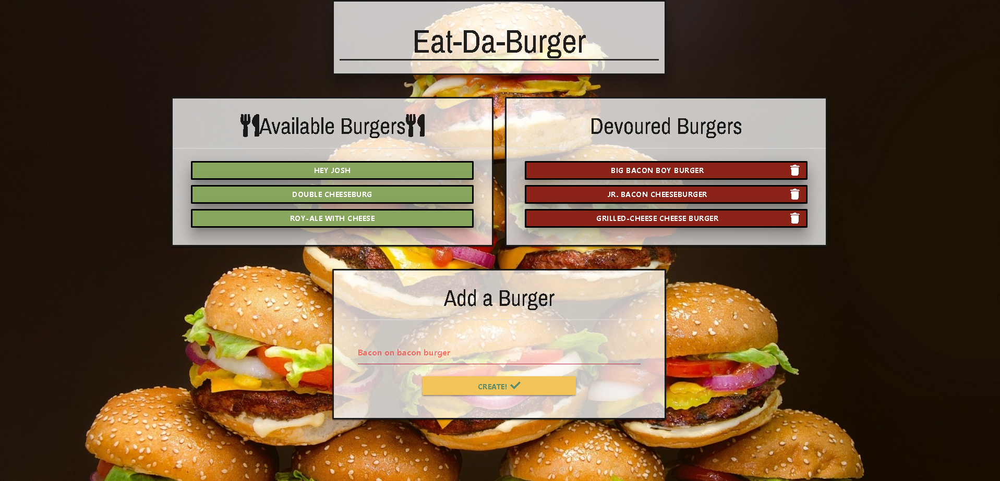

# sequelizedBurger

### Check out the live version on heroku
**[Eat-Da-Burger](https://eat-dat-sequelized-burg.herokuapp.com/burgers)**

## Description 

This app is an updated version of my eat-da-burgers app, except this time its using sequelize. you can add burgers to the available burgers sections, and _devourer_ burgers by clicking them sending them to the _devoured_ section. _Don't_ like a burger? Click it again in the devoured section to get rid of it for good! The app follows MVC design patterns. Everytime you _eat_ an available burger you send a POST request to the database, allowing it to update for you in real time! Same with clicking a _devoured_ burger!

## Technologies used
- Node.js
- Javascript
- Jquery
- Materialize
- HTML/CSS
- NPM body-parser
- NPM express 
- NPM dotenv
- NPM mysql2
- NPM express-handlebars
- NPM sequelize
- NPM sequelize-clie
    * Optional use
    - vagrant

## Instructions for local use
**prerequisites**
- Install node.js/npm

    - Git-Clone to repo to a spot on your desktop
    - in your favorite CLI (gitbash/terminal) cd to the folder with .git
    - there will also be a vagrantfile in this folder
        - (if you do not wish to use vagrant skip these next steps)
        - vagrant up to initialize the box
        - vagrant ssh when ready
        - cd /var/www
        - npm install
        - node server.js
        - go to 192.168.15.10:3000 on your browser
        - (make sure you have a mysql database and run the schema/seeds file to set up database)
    - npm install
    - set up your favorite mysql database (run the schema/seed files to start your table)
    - node server.js
    - localhost:3000 on your browser

# Author
## *Joshua LeBoeuf*